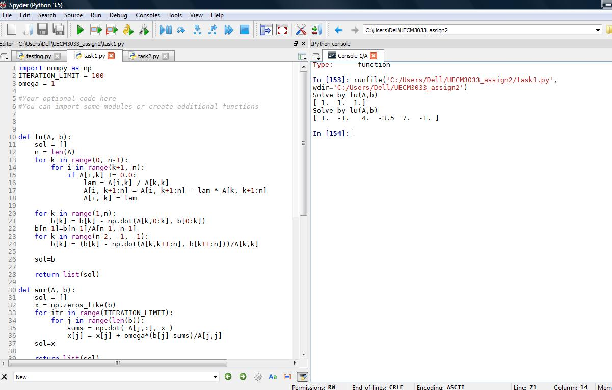
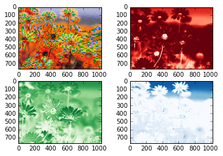
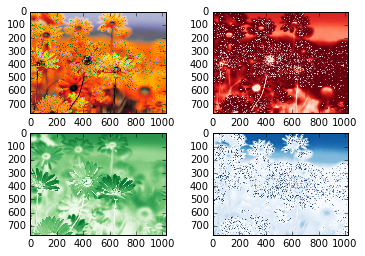
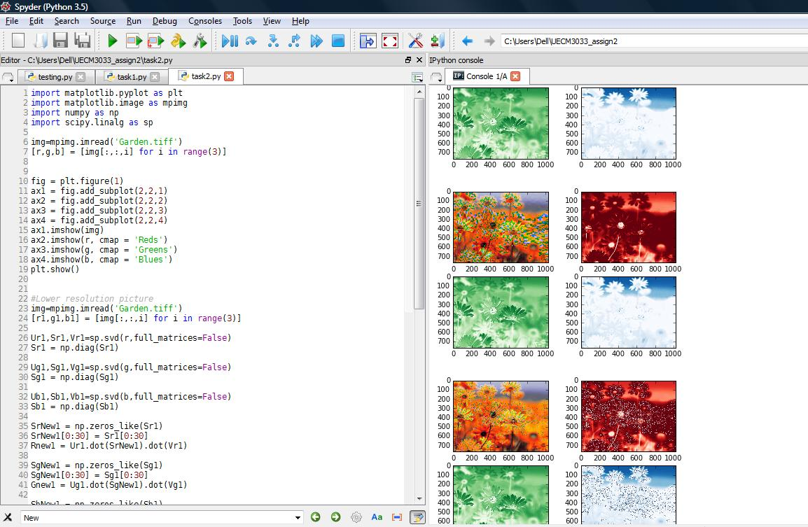

UECM3033 Assignment #2 Report
========================================================

- Prepared by: ** Jamie Lee Mei Mei**
- Tutorial Group: T2/T3

--------------------------------------------------------

## Task 1 --  $LU$ Factorization or SOR method

The reports, codes and supporting documents are to be uploaded to Github at: 

[https://github.com/JamieLeeMM/UECM3033_assign2](https://github.com/JamieLeeMM/UECM3033_assign2)

Explain your selection criteria here.

Sor is for positive diagonal elements and positive definite. Besides, it is also used when 0<w<2. Even though the matrices in this questions are strictly diagonally dominant but they are not symmetrical. However, we can still iterate through out the matrix for this question.

Explain how you implement your `task1.py` here.

First we defined a LU and SOR function. Then for SOR function we select the iteration to 100 times in order to obtain a more accurate answer.
After I compute both LU and SOR method , we compare the value we get. After that, we choose the method where the value converge most to the true value or the expected value. The method that provide a value which is nearer to the expected value are believed to be a better method to be used.

The solutions i got using LU decomposition are

 Solve by lu(A,b)
[ 1.  1.  1.]
Solve by lu(A,b)
[ 1.  -1.   4.  -3.5  7.  -1. ]

---------------------------------------------------------

## Task 2 -- SVD method and image compression

Put here your picture file (Lenna.png)

How many non zero element in $\Sigma$?
By using 
np.count_nonzero(Sr1)
Out[151]: 768
we get 768 non zero element in Sigma.

Put here your lower and better resolution pictures.
  
lower resolution

 
higher resolution

Explain how you generate these pictures from `task2.py`.

First, I called out the image by "img=mpimg.imread('Garden.tiff')". Then I setup 3 different matrices : R G and B (RED, Green and Blue). 

Next , "Ur1,Sr1,Vr1=sp.svd(r,full_matrices=False)" can provide me the singular value decomposition for each 3 different matrices , rgb. 

Then , we get each diagonal matrices with np.diag(S).

Lower resolutions:

SgNew1 = np.zeros_like(Sg1)

SgNew1[0:30] = Sg1[0:30]

Gnew1 = Ug1.dot(SgNew1).dot(Vg1)

Through these 3 lines, I can get the lower resolution for the matrix g. then the same applies to the other 2 matrices which are r and b with the same codes. 

Higher resolutions:

By taking the first 200 diagonal values instead of 30, I can get the higher resolutions for the matrix g as shown below. 

SgNew2 = np.zeros_like(Sg2)
SgNew2[0:200] = Sg2[0:200]
Gnew2 = Ug2.dot(SgNew2).dot(Vg2)

What is a sparse matrix?

A sparse matrix is a matrix in which most of the elements inside are zeroes.  

-----------------------------------

last modified: 11/3/16
